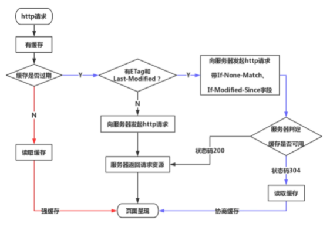

# http缓存

浏览器缓存分为强缓存和协商缓存，浏览器加载一个页面的简单流程如下：
- 浏览器先根据这个资源的http头信息来判断是否命中强缓存。如果命中则直接加载缓存中的资源，并不会将请求发送到服务器。如果未命中强缓存，则浏览器会将资源加载请求发送到服务器。
- 服务器来判断浏览器本地缓存是否失效。若可以使用，则服务器并不会返回资源信息，浏览器继续从缓存加载资源。
- 如果未命中协商缓存，则服务器会将完整的资源返回给浏览器，浏览器加载新资源，并更新缓存。

## 强缓存
强缓存是利用http的返回头中的Expires或者Cache-Control两个字段来控制的，用来表示资源的缓存时间。
- Expires缓存过期时间，Expires = max-age + 请求时间，与last-modified结合使用。（响应头）
- cache-control：比 expires优先级高
- max-age 有效时间长度（s）
- no-cache 强制所有缓存了该响应的用户，在使用已缓存的数据前，发送带验证器的请求到服务器。不是字面意思上的不缓存。
- no-store 禁止缓存，每次请求都要向服务器重新获取数据

## 协商缓存
若未命中强缓存，则请求到服务器端后，根据请求头中的 Last-Modify/If-Modify-Since 及 Etag/If-None-Match 信息判断请求数据是否更新，未更新则返回304，浏览器从缓存中获取数据。

### Last-Modify/If-Modify-Since
- 浏览器首次发送一个请求时，服务器会在响应头中加入 Last-Modify 信息，表示最后修改时间；
- 浏览器在之后发送该请求时，首先判断是否有 Last-Modify 信息，有则将其作为 If-Modify-Since 加入到请求头中发送给服务器；
- 服务器根据请求头的 If-Modify-Since 及数据最后更新时间判断内容是否已更新。

### Etag/If-None-Match
Etag的出现主要是为了弥补 Last-Modify 的缺陷，如下：
- Last-Modify 精确到秒，如果一个内容在一秒内经过了多次更改，则无法获取到最新内容；
- 服务器未准确获取到内容的最后修改时间，或与代理服务器时间不一致等；
- 获取定期更改的文件，内容未变，但文件最后修改时间更新了，那就失去了缓存的作用。

Etag 是一个校验码（entity tag），内容更改后就会生成新的Etag码，以此校验内容的更新。流程与 Last-Modify 类似，服务器返回Etag，浏览器将Etag作为 If-None-Match 加入请求头发送给服务器进行校验。

注：http1.1规范并未规定Etag要如何计算生成，计算就要消耗性能，可禁用，但需要权衡利弊。

##  缓存命中流程图

参考地址： 
1. HTTP缓存机制 [https://www.cnblogs.com/ranyonsue/p/8918908.html](https://www.cnblogs.com/ranyonsue/p/8918908.html)